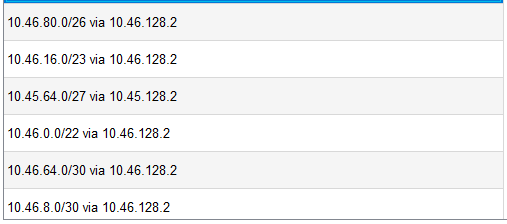

# Jarkom-Modul-4-E17-2023
Kelompok E17 -
Jaringan Komputer (F) </br>
*Insitut Teknologi Sepuluh Nopember*

**Authors :**
| Name                  | Student ID |
| ----------------------|------------|
| Rizky Alifiyah Rahma  | 5025211208 |
| Dilla Wahdana         | 5025211234 |

## Cisco CIDR
### Topologi
#### Penggabungan 1


#### Penggabungan 2


#### Penggabungan 3


#### Penggabungan 4


#### Penggabungan 5


#### Penggabungan 6


#### Penggabungan 7


#### Hasil Penggabungan


### Tree


### Pembagian IP CIDR
| Subnet | Network ID    | Netmask           | Broadcast     |
|--------|---------------|-------------------|---------------|
| A1     | 10.45.0.0     | 255.255.248.0     | 10.45.7.255   |
| A2     | 10.45.16.0    | 255.255.252.0     | 10.45.19.255  |
| A3     | 10.45.20.0    | 255.255.255.248   | 10.45.20.7    |
| A4     | 10.45.64.0    | 255.255.255.224   | 10.45.64.31   |
| A5     | 10.46.80.0    | 255.255.255.248   | 10.46.80.7    |
| A6     | 10.46.4.0     | 255.255.255.192   | 10.46.4.63    |
| A7     | 10.46.0.0     | 255.255.252.0     | 10.46.3.255   |
| A8     | 10.46.16.0    | 255.255.254.0     | 10.46.17.255  |
| A9     | 10.46.64.4    | 255.255.255.0     | 10.46.64.255  |
| A10    | 10.46.72.4    | 255.255.252.0     | 10.46.75.255  |
| A11    | 10.46.80.8    | 255.255.255.252   | 10.46.80.11   |
| A12    | 10.47.0.0     | 255.255.255.0     | 10.47.0.255   |
| A13    | 10.45.4.0     | 255.255.255.252   | 10.45.4.3     |
| A14    | 10.45.20.8    | 255.255.255.252   | 10.45.20.11   |
| A15    | 10.45.32.0    | 255.255.255.252   | 10.45.32.3    |
| A16    | 10.45.128.0   | 255.255.255.252   | 10.45.128.3   |
| A17    | 10.46.128.0   | 255.255.255.252   | 10.46.128.3   |
| A18    | 10.46.32.0    | 255.255.255.252   | 10.46.32.3    |
| A19    | 10.46.8.0     | 255.255.255.252   | 10.46.8.3     |
| A20    | 10.46.64.0    | 255.255.255.252   | 10.46.72.3    |
| A21    | 10.47.1.0     | 255.255.255.252   | 10.47.1.3     |

### Subnetting

#### A1
##### AppetitRegion
- Gateway = 10.45.0.1
- Address = 10.45.0.2
- Subnet Mask = 255.255.248.0

##### LaubHills
- Gateway = 10.45.0.1
- Address = 10.45.0.3
- Subnet Mask = 255.255.248.0

##### Fern (Fa0/1)
- Address = 10.45.0.1
- Subnet Mask = 255.255.248.0

#### A2
##### RohrRoad
- Gateway = 10.45.16.1
- Address = 10.45.16.2
- Subnet Mask = 255.255.252

##### Flamme (Fa1/1)
- Address = 10.45.16.1
- Subnet Mask = 255.255.252.0

#### A3
##### SchwerMountains
- Gateway = 10.45.20.1
- Address = 10.45.20.2
- Subnet Mask = 255.255.255.248

##### Himmel (Fa0/1)
- Address = 10.45.20.1
- Subnet Mask = 255.255.255.248

#### A4
##### LakeKorridor
- Gateway = 10.45.64.1
- Address = 10.45.64.2
- Subnet Mask = 255.255.255.224

##### Frieren (Fa1/0)
- Address = 10.45.64.1
- Subnet Mask = 255.255.255.224


#### A5
##### Richter
- Gateway = 10.46.80.1
- Address = 10.46.80.2
- Subnet Mask = 255.255.255.248

##### Revolte
- Gateway = 10.46.80.1
- Address = 10.46.80.3
- Subnet Mask = 255.255.255.248

##### Eisen (Eth1/2)
- Address = 10.46.80.1
- Subnet Mask = 255.255.255.248


#### A6
##### BredRegion
- Gateway = 10.46.4.1
- Address = 10.46.4.2
- Subnet Mask = 255.255.255.192

##### Lawine (Fa0/1)
- Address = 10.45.4.1
- Subnet Mask = 255.255.255.192

##### Heiter (Fa0/0)
- Address = 10.46.4.3
- Subnet Mask = 255.255.255.192


#### A7
##### Sein
- Gateway = 10.46.0.1
- Address = 10.46.0.2
- Subnet Mask = 255.255.252.0

##### RiegelCanyon
- Gateway = 10.46.0.1
- Address = 10.45.0.3
- Subnet Mask = 255.255.252.0

##### Heiter (Fa0/1)
- Address = 10.46.0.1
- Subnet Mask = 255.255.252.0


#### A8
##### GranzChannel
- Gateway = 10.46.16.1
- Address = 10.46.16.2
- Subnet Mask = 255.255.254.0

##### Linie (Fa0/1)
- Address = 10.46.16.1
- Subnet Mask = 255.255.254.0

#### A9
##### GrobeForest
- Gateway = 10.46.68.1
- Address = 10.46.68.2
- Subnet Mask = 255.255.255.0

##### Lugner (Fa1/0)
- Address = 10.46.68.1
- Subnet Mask = 255.255.255.0

#### A10
##### TurkRegion
- Gateway = 10.46.64.1
- Address = 10.46.64.2
- Subnet Mask = 255.255.252.0

##### Lugner (Fa0/1)
- Address = 10.46.63.1
- Subnet Mask = 255.255.252.0

#### A11
##### Stark
- Gateway = 10.46.80.9
- Address = 10.46.80.10
- Subnet Mask = 255.255.255.252

##### Eisen (Fa0/1)
- Address = 10.46.80.9
- Subnet Mask = 255.255.255.252


#### A12
##### RoyalCapital
- Gateway = 10.47.0.1
- Address = 10.47.0.2
- Subnet Mask = 255.255.255.0

##### WileRegion
- Gateway = 10.47.0.1
- Address = 10.47.0.3
- Subnet Mask = 255.255.255.0

##### Denken (Fa0/1)
- Address = 10.47.0.1
- Subnet Mask = 255.255.255.0

#### A13 
##### Fern (Fa0/0)
- Address = 10.45.4.2
- Subnet Mask = 255.255.255.252

##### Flamme (Fa1/0)
- Address = 10.45.4.1
- Subnet Mask = 255.255.255.252


#### A14
##### Himmel (Fa0/0)
- Address = 10.45.20.10
- Subnet Mask = 255.255.255.252

##### Flamme (Fa0/1)
- Address = 10.45.20.9
- Subnet Mask = 255.255.255.252


#### A15
##### Flamme (Fa0/0)
- Address = 10.45.32.2
- Subnet Mask = 255.255.255.252

##### Frieren (Fa0/1)
- Address = 20.45.32.1
 -Subnet Mask = 255.255.255.252

#### A16
##### Frieren (Fa0/0)
- Address = 10.45.128.2
- Subnet Mask = 255.255.255.252

##### Aura (Fa1/1)
- Address = 10.45.128.1
- Subnet Mask = 255.255.255.252


#### A17
##### Aura (Fa0/1)
- Address = 10.46.128.1
- Subnet Mask = 255.255.255.252

##### Eisen (Fa0/0)
- Address = 10.46.128.2
- Subnet Mask = 255.255.255.252

#### A18
##### Eisen (Eth1/1)
- Address = 10.46.80.1
- Subnet Mask = 255.255.255.248

##### Linie (Fa1/0)
- Address = 10.46.8.1
- Subnet Mask = 255.255.255.252


#### A19
##### Lawine (Fa0/0)
- Address = 10.46.8.2
- Subnet Mask = 255.255.255.252

##### Linie (Fa1/0)
- Address = 10.46.8.1
- Subnet Mask = 255.255.255.252


#### A20
##### Eisen (Eth1/0)
- Address = 10.46.72.1
- Subnet Mask = 255.255.255.252

##### Lugner (Fa0/0)
- Address = 10.46.72.2
- Subnet Mask = 255.255.255.252


#### A21
##### Aura (Fa1/0)
- Address = 10.47.1.1
- Subnet Mask = 255.255.255.252

##### Denken (Fa0/0)
- Address = 10.47.1.2
- Subnet Mask = 255.255.255.252


### Routing
#### Aura




#### Denken


#### Frieren

#### Flamme

#### Fern

#### Himmel

#### Eisen


#### Lugner

#### Linie

#### Lawine

#### Heiter


## GNS3 VLSM
### Topologi


### Tree


### Pembagian IP VLSM
| Subnet | Network ID | Netmask | Broadcast |
| --- | --- | --- | --- |
| A1 | 10.45.24.0 | 255.255.248.0 | 10.45.31.255 |
| A2 | 10.45.8.0 | 255.255.252.0 | 10.45.11.255 |
| A3 | 10.45.0.48	| 255.255.255.248	| 10.45.0.55 |
| A4 | 10.45.0.64	| 255.255.255.224	| 10.45.0.95 |
| A5 | 10.45.0.40	| 255.255.255.248	| 10.45.0.47 |
| A6 | 10.45.0.128 | 255.255.255.192 | 10.45.0.191 |
| A7 | 10.45.12.0 | 255.255.252.0	| 10.45.15.255 |
| A8 | 10.45.4.0	| 255.255.254.0	| 10.45.5.255 |
| A9 | 10.45.1.0 | 255.255.255.0 | 10.45.1.255 |
| A10	| 10.45.16.0 | 255.255.252.0	| 10.45.19.255 |
| A11	| 10.45.0.0 |	255.255.255.252	| 10.45.0.3 |
| A12	| 10.45.2.0	| 255.255.255.0 |	10.45.2.255 |
| A13	| 10.45.0.4	| 255.255.255.252	| 10.45.0.7 |
| A14	| 10.45.0.8	| 255.255.255.252	| 10.45.0.11 |
| A15	| 10.45.0.12 | 255.255.255.252 | 10.45.0.15 |
| A16	| 10.45.0.16 | 255.255.255.252 | 10.45.0.19 |
| A17	| 10.45.0.20 | 255.255.255.252 | 10.45.0.23 |
| A18	| 10.45.0.24 | 255.255.255.252 | 10.45.0.27 |
| A19	| 10.45.0.28 | 255.255.255.252 | 10.45.0.31 |
| A20	| 10.45.0.32 | 255.255.255.252 | 10.45.0.35 |
| A21	| 10.45.0.36 | 255.255.255.252 | 10.45.0.39 |
| Total |  | 4255 | /19 |

### IP Configuration VLSM

#### Aura
```sql
auto eth0
iface eth0 inet dhcp

auto eth1
iface eth1 inet static
	address 10.45.0.17
	netmask 255.255.255.252

iface eth2 inet static
	address 10.45.0.37
	netmask 255.255.255.252

auto eth3
iface eth3 inet static
	address 10.45.0.21
	netmask 255.255.255.252
```
#### Denken
```sql
auto eth0
iface eth0 inet static
	address 10.45.0.38
	netmask 255.255.255.252
	gateway 10.45.0.37

auto eth1
iface eth1 inet static
	address 10.45.2.1
	netmask 255.255.255.0
```
#### RoyalCapital
```sql
auto eth0
iface eth0 inet static
	address 10.45.2.2
	netmask 255.255.255.0
	gateway 10.45.2.1
```
#### WilleRegion
```sql
auto eth0
iface eth0 inet static
	address 10.45.2.3
	netmask 255.255.255.0
	gateway 10.45.2.1
```
#### Frieren
```sql
auto eth0
iface eth0 inet static
	address 10.45.0.18
	netmask 255.255.255.252
	gateway 10.45.0.17

auto eth1
iface eth1 inet static
	address 10.45.0.65
	netmask 255.255.255.224

auto eth2
iface eth2 inet static
	address 10.45.0.13
	netmask 255.255.255.252
```
#### LakeKorridor
```sql
auto eth0
iface eth0 inet static
	address 10.45.0.66
	netmask 255.255.255.224
	gateway 10.45.0.65
```
#### Flamme
```sql
auto eth0
iface eth0 inet static
	address 10.45.0.14
	netmask 255.255.255.252
	gateway 10.45.0.13

auto eth1
iface eth1 inet static
	address 10.45.0.5
	netmask 255.255.255.252

auto eth2
iface eth2 inet static
	address 10.45.8.1
	netmask 255.255.252.0

auto eth3
iface eth3 inet static
	address 10.45.0.9
	netmask 255.255.255.252
```
#### Fren
```sql
auto eth0
iface eth0 inet static
	address 10.45.0.6
	netmask 255.255.255.252
	gateway 10.45.0.5

auto eth1
iface eth1 inet static
	address 10.45.24.1
	netmask 255.255.248.0
 ```
#### AppetitRegion
```sql
auto eth0
iface eth0 inet static
	address 10.45.24.2
	netmask 255.255.248.0
	gateway 10.45.24.1
 ```
#### LaubHills
```sql
auto eth0
iface eth0 inet static
	address 10.45.24.3
	netmask 255.255.248.0
	gateway 10.45.24.1
 ```
#### RohrRoad
```sql
auto eth0
iface eth0 inet static
	address 10.45.8.2
	netmask 255.255.252.0
	gateway 10.45.8.1
 ```
#### Himmel
```sql
auto eth0
iface eth0 inet static
	address 10.45.0.10
	netmask 255.255.255.252
	gateway 10.45.0.9

auto eth1
iface eth1 inet static
	address 10.45.0.49
	netmask 255.255.255.248
 ```
#### SchwerMountains
```sql
auto eth0
iface eth0 inet static
	address 10.45.0.50
	netmask 255.255.255.248
	gateway 10.45.0.49
 ```
#### Eisen
```sql
auto eth0
iface eth0 inet static
	address 10.45.0.22
	netmask 255.255.255.252
	gateway 10.45.0.21

auto eth1
iface eth1 inet static
	address 10.45.0.1
	netmask 255.255.255.252

auto eth2
iface eth2 inet static
	address 10.45.0.33
	netmask 255.255.255.252

auto eth3
iface eth3 inet static
	address 10.45.0.25
	netmask 255.255.255.252

auto eth4
iface eth4 inet static
	address 10.45.0.41
	netmask 255.255.255.248
```
#### Stark
```sql
auto eth0
iface eth0 inet static
	address 10.45.0.2
	netmask 255.255.255.252
	gateway 10.45.0.1
```
#### Ritcher
```sql
auto eth0
iface eth0 inet static
	address 10.45.0.42
	netmask 255.255.255.248
	gateway 10.45.0.41
```
#### Revolte
```sql
auto eth0
iface eth0 inet static
	address 10.45.0.43
	netmask 255.255.255.248
	gateway 10.45.0.41
 ```
#### Lugner
```sql
auto eth0
iface eth0 inet static
	address 10.45.0.34
	netmask 255.255.255.252
	gateway 10.45.0.33

auto eth1
iface eth1 inet static
	address 10.45.16.1
	netmask 255.255.252.0

auto eth2
iface eth2 inet static
	address 10.45.1.1
	netmask 255.255.255.0
```
#### TurkRegion
```sql
auto eth0
iface eth0 inet static
	address 10.45.16.2
	netmask 255.255.252.0
	gateway 10.45.16.1
 ```
#### GrobeForest
```sql
auto eth0
iface eth0 inet static
	address 10.45.1.2
	netmask 255.255.255.0
	gateway 10.45.1.1
 ```
#### Linie
```sql
auto eth0
iface eth0 inet static
	address 10.45.0.26
	netmask 255.255.255.252
	gateway 10.45.0.25

auto eth1
iface eth1 inet static
	address 10.45.4.1
	netmask 255.255.254.0

auto eth2
iface eth2 inet static
	address 10.45.0.29
	netmask 255.255.255.252
 ```
#### GranzChannel
```sql
auto eth0
iface eth0 inet static
	address 10.45.4.2
	netmask 255.255.254.0
	gateway 10.45.4.1
 ```
#### Lawine
```sql
auto eth0
iface eth0 inet static
	address 10.45.0.30
	netmask 255.255.255.252
	gateway 10.45.0.29

auto eth1
iface eth1 inet static
	address 10.45.0.129
	netmask 255.255.255.192
 ```
#### BredtRegion
```sql
auto eth0
iface eth0 inet static
	address 10.45.0.131
	netmask 255.255.255.192
	gateway 10.45.0.129
 ```
#### Heiter
```sql
auto eth0
iface eth0 inet static
	address 10.45.0.130
	netmask 255.255.255.192
	gateway 10.45.0.129

auto eth1
iface eth1 inet static
	address 10.45.12.1
	netmask 255.255.252.0
 ```
#### Sein
```sql
auto eth0
iface eth0 inet static
	address 10.45.12.3
	netmask 255.255.252.0
	gateway 10.45.12.1
 ```
#### RiegelCanyon
```sql
auto eth0
iface eth0 inet static
	address 10.45.12.2
	netmask 255.255.252.0
	gateway 10.45.12.1
 ```

### Routing
#### Fren
```sql
echo nameserver 192.168.122.1 > /etc/resolv.conf
route add -net 0.0.0.0 netmask 0.0.0.0 gw 10.45.0.5
```
#### Himmel
```sql
echo nameserver 192.168.122.1 > /etc/resolv.conf
route add -net 0.0.0.0 netmask 0.0.0.0 gw 10.45.0.9
```
#### Flamme
```sql
echo nameserver 192.168.122.1 > /etc/resolv.conf
route add -net 0.0.0.0 netmask 0.0.0.0 gw 10.45.0.13

# A14
route add -net 10.45.0.8 netmask 255.255.255.252 gw 10.45.0.10
# A3
route add -net 10.45.0.48 netmask 255.255.255.248 gw 10.45.0.10
# A13
route add -net 10.45.0.4 netmask 255.255.255.252 gw 10.45.0.6
# A1
route add -net 10.45.24.0 netmask 255.255.248.0 gw 10.45.0.6
```
#### Frieren
```sql
echo nameserver 192.168.122.1 > /etc/resolv.conf
route add -net 0.0.0.0 netmask 0.0.0.0 gw 10.45.0.17

# A15
route add -net 10.45.0.12 netmask 255.255.255.252 gw 10.45.0.14
# A2
route add -net 10.45.8.0 netmask 255.255.252.0 gw 10.45.0.14
# A14
route add -net 10.45.0.8 netmask 255.255.255.252 gw 10.45.0.14
# A3
route add -net 10.45.0.48 netmask 255.255.255.248 gw 10.45.0.14
# A13
route add -net 10.45.0.4 netmask 255.255.255.252 gw 10.45.0.14
# A1
route add -net 10.45.24.0 netmask 255.255.248.0 gw 10.45.0.14
```
#### Heiter
```sql
echo nameserver 192.168.122.1 > /etc/resolv.conf
route add -net 0.0.0.0 netmask 0.0.0.0 gw 10.45.0.129
```
#### Lawine
```sql
echo nameserver 192.168.122.1 > /etc/resolv.conf
route add -net 0.0.0.0 netmask 0.0.0.0 gw 10.45.0.29

# A6
route add -net 10.45.0.128 netmask 255.255.255.192 gw 10.45.0.130
# A7
route add -net 10.45.12.0 netmask 255.255.252.0 gw 10.45.0.130
```
#### Linie
```sql
echo nameserver 192.168.122.1 > /etc/resolv.conf
route add -net 0.0.0.0 netmask 0.0.0.0 gw 10.45.0.25

# A19
route add -net 10.45.0.28 netmask 255.255.255.252 gw 10.45.0.30
# A6
route add -net 10.45.0.128 netmask 255.255.255.192 gw 10.45.0.30
# A7
route add -net 10.45.12.0 netmask 255.255.252.0 gw 10.45.0.30
```
#### Lugner
```sql
echo nameserver 192.168.122.1 > /etc/resolv.conf
route add -net 0.0.0.0 netmask 0.0.0.0 gw 10.45.0.33
```
#### Denken
```sql
echo nameserver 192.168.122.1 > /etc/resolv.conf
route add -net 0.0.0.0 netmask 0.0.0.0 gw 10.45.0.37
```
#### Eisen
```sql
echo nameserver 192.168.122.1 > /etc/resolv.conf
route add -net 0.0.0.0 netmask 0.0.0.0 gw 10.45.0.21

# A20
route add -net 10.45.0.32 netmask 255.255.255.252 gw 10.45.0.34
# A10
route add -net 10.45.16.0 netmask 255.255.252.0 gw 10.45.0.34
# A9
route add -net 10.45.1.0 netmask 255.255.255.0 gw 10.45.0.34
# A18
route add -net 10.45.0.24 netmask 255.255.255.252 gw 10.45.0.26
# A19
route add -net 10.45.0.28 netmask 255.255.255.252 gw 10.45.0.26
# A8
route add -net 10.45.4.0 netmask 255.255.254.0 gw 10.45.0.26
# A6
route add -net 10.45.0.128 netmask 255.255.255.192 gw 10.45.0.26
# A7
route add -net 10.45.12.0 netmask 255.255.252.0 gw 10.45.0.26
```
#### Aura
```sql
iptables -t nat -A POSTROUTING -o eth0 -j MASQUERADE -s 10.45.0.0/16

#A1 
route add -net 10.45.24.0 netmask 255.255.248.0 gw 10.45.0.18
#A2 
route add -net 10.45.8.0 netmask 255.255.252.0 gw 10.45.0.18 
#A3
route add -net 10.45.0.48 netmask 255.255.255.248 gw 10.45.0.18
#A4
route add -net 10.45.0.64 netmask 255.255.255.224 gw 10.45.0.18 
#A5
route add -net 10.45.0.40 netmask 255.255.255.248 gw 10.45.0.22
#A6
route add -net 10.45.0.128 netmask 255.255.255.192 gw 10.45.0.22
#A7 
route add -net 10.45.12.0 netmask 255.255.252.0 gw 10.45.0.22 
#A8 
route add -net 10.45.4.0 netmask 255.255.254.0 gw 10.45.0.22  
#A9 
route add -net 10.45.1.0 netmask 255.255.255.0 gw 10.45.0.22 
#A10 
route add -net 10.45.16.0 netmask 255.255.252.0 gw 10.45.0.22
#A11 
route add -net 10.45.0.0 netmask 255.255.255.252 gw 10.45.0.22 
#A12
route add -net 10.45.2.0 netmask 255.255.255.0 gw 10.45.0.38 X
#A13 
route add -net 10.45.0.4 netmask 255.255.255.252 gw 10.45.0.18
#A14
route add -net 10.45.0.8 netmask 255.255.255.252 gw 10.45.0.18 
#A15
route add -net 10.45.0.12 netmask 255.255.255.252 gw 10.45.0.18
#16
route add -net 10.45.0.16 netmask 255.255.255.252 gw 10.45.0.18
#17
route add -net 10.45.0.20 netmask 255.255.255.252 gw 10.45.0.22
#A18
route add -net 10.45.0.24 netmask 255.255.255.252 gw 10.45.0.22 
#A19
route add -net 10.45.0.28 netmask 255.255.255.252 gw 10.45.0.22
#A20
route add -net 10.45.0.32 netmask 255.255.255.252 gw 10.45.0.22
#21
route add -net 10.45.0.36 netmask 255.255.255.252 gw 10.45.0.38 X
```
#### Tambahkan setiap konfigurasi pada /root/.bashrc
```sql
nano /root/.bashrc
```
### Hasil Testing
RoyalCapital - WilleRegion


LaubHills - AppetitRegion


RohrRoad - SchewerMountains


RiegelCanyon - GranzChannel


TurkRegion - Stark


